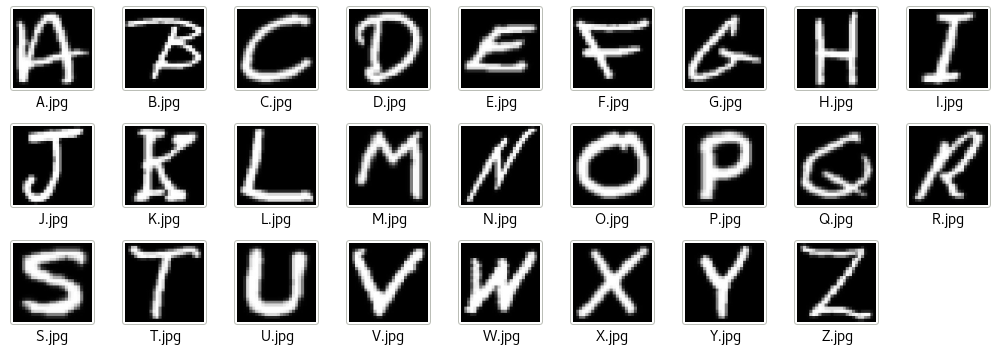
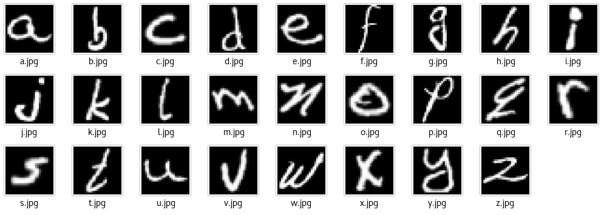
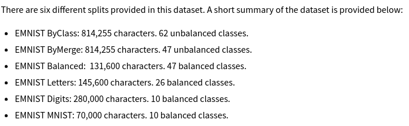
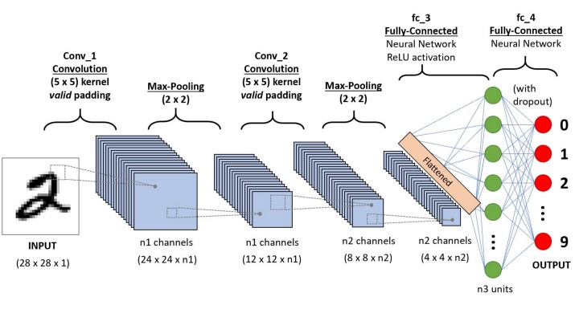

# My Project Title: Object Recognition!

## Abstract

To create a CNN model which correctly identifies an object within given data i.e. image/scene. 
I will be using my selected dataset to try to recoginise the hand-written letters of the alphabet, from the EMNIST Letters dataset.Training the model to recognise each letter of the alphabet, both in lowercase and uppercase forms.

## Detailed Description

I will use batches of the images of the hand-written Alphabet Letters to train the CNN and the classification models by updating the parameters after each epoch, in order for the model to recognise the letter and be able to verify with its corresponding label. Additionally, based on the success rate of my model, I will try to add to the dataset by introducing a number of new samples, in my own hand writing to see how the model perfoms then.

If the model struggles with recognition of my own hand written data, I will stick with the dataset given, and only test the model using digitised image of a letter. If my model recognises these letters successfully in not only the training & validation but also the testing loops, with an accuracy rate of 90%, I will consider this as a successful model for Object Recognition with regards to my chosen EMNIST Letters dataset.

### Datasets
**Datasets Introduction:** The dataset I will be using for my recognition project contains 145,600 samples of handwritten letters of the english alphabet, consisting of an even share of both Uppercase and Lowercase Letters. 

**Train & Validation, and Test Samples:** This dataset has already been split into two parts, with 85.71% allocated to training & validation, and 14.28% each towards testing purposes; this should serve my process well.

**Challenges:** Due to the format & size of the Dataset, it has been diffult to preview the quality and consistancy of the dataset. This project will require some work to understand the dataset's binary formatting, and transforming it correctly for my model.

### Arcitecture Proposal

**I)** Firstly set the value to the conventional kernels.

**II)** Then pass the images of the handwritten letters of the alaphabet through the kernels, in order to convolute these images.

**III)** Once we've convoluted these images, we can pool the images and then activate them. (We can repeat the second and third steps until we get the desired effect).

**IV)** Then this will result in many images which represent partial features from the originally input images.

**V)** The final images will now be laid out in order to generate our input layer of the fully-connected Neural Network, and based off of this, we will classify the batch of images.

**VI)** In order to minimise the value of the cost function, we will update the value of the weight parameters after each trainng batch, until the accuracy reaches convergence.

**VII)** This should result in a fine trained model which will successfully classify our letters, including both lower-case and upper-case letters.

          

## References

[1] Cohen, Gregory, et al. "EMNIST: Extending MNIST to handwritten letters." 2017 international joint conference on neural networks (IJCNN). IEEE, 2017.

[2] The EMNIST Dataset, https://www.nist.gov/itl/products-and-services/emnist-dataset, 2022.

[3] Baldominos A, et al. "A Survey of Handwritten Character Recognition with MNIST and EMNIST", 2019. 

<<<<<<< HEAD:Proposal/Object-Recognition-code-and-design-review-Jeri-Chaudhry.md
<<<<<<< HEAD

=======
>>>>>>> aafd584fa7721735919cc2d23f224aa6453e7e63
=======

>>>>>>> 4d3cc1c8070c2bce38a8ab6a96714fc7a2c878b9:Object-Recognition-code-and-design-review-Jeri-Chaudhry.md
